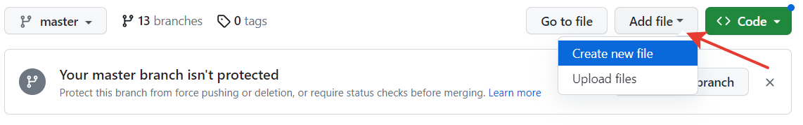
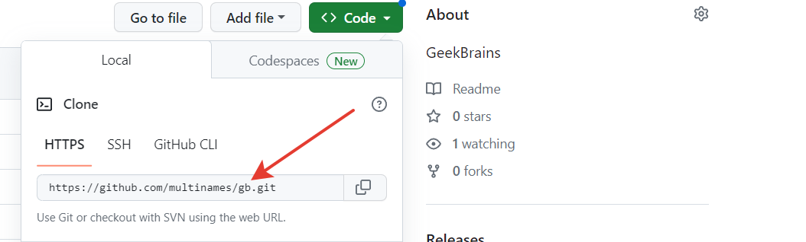

# Инструкция для работы с Git и удалёнными репозиториями
# Что такое Git?
Git - это одна из реализаций распределённых систем контроля версий, имеющая как и локальные, так и удалённые репозитории. Является самой популярной реализацией систем контроля версий в мире.
# Подготовка репозитория
Для создание репозитория необходимо выполнить команду _git init_ в папке с репозиторием и у Вас создаться репозиторий (появится скрытая папка .git)

# Создание коммитов
## Git add
Для добавления измений в коммит используется команда *git add*. Чтобы использовать команду git add напишите *git add <имя файла>*

Просмотр состояния репозитория
---
Для того, чтобы посмотреть состояние репозитория используется команда *git status*. Для этого необходимо в папке с репозиторием написать *git status*, и Вы увидите были ли измения в файлах, или их не было.

## Создание коммитов
Для того, чтобы создать коммит(сохранение) необходимо выполнить команду *git commit*. Выполняется она так: *git commit -m "<сообщение к коммиту>*. Все файлы для коммита должны быть ***ДОБАВЛЕНЫ*** и сообщение к коммиту писать ***ОБЯЗАТЕЛЬНО***.

# Добавление картинок
## Картинка
   
## Гифка
   
## Картинка из папки
   

# Перемещение между сохранениями
Для того, чтобы перемещаться между коммитами, используется команда *git checkout*. Используется она в папке с пепозиторием следующим образом: *git checkout <номер коммита>*
# Слияние веток
Для того чтобы дабавить ветку в текущую ветку используется команда *git merge*
# Журнал изменений
Для того, чтобы посмтреть все сделанные изменения в репозитории, используется команда _git log_. Для этого достаточно выполнить команду _git log_ в папке с репозиторием
# Ветки в Git
Создание ветки
Для того, чтобы создать ветку, используется команда *git branch*. Делается это следующим образом в папке с репозиторием: *git branch <название новой ветки>*

смотрим команду git commit -am "save all"

# Работа с GitHub

## Регистрация в GitHub
Для подключения к github.com нужно зарегистрироваться на нем по кнопке **Sign up**

## Создание репозитория на GitHub 
Для создания нового репозитория нужно нажать значок **+** в правом верхнем углу и выбрать **New repository**. 

В открывшейся форме, необходимо указать имя репозитория и его описание.

Репозиторий можно сделать публичным или приватным, ограничить права кругу пользователей или кому-то одному, нужный вариант можно выбрать в "Тип репозитория".

Завершить создание репозитория нужно кнопкой **Create repository**

## Работа с репозиторием на GitHub
После создания репозитория в него можно добавить новый файл по кнопке Add file

Далее необходимо зафиксировать изменения в созданном файле, после чего репозиторий можно загрузить к себе на локальный компьютер командой:

**git clone** [url-адрес]

url-адрес - можно скопировав его по кнопке **Code**

После того, как репозиторий будет загружен на локальный компьютер - с ним можно работать.

Внесенные в проект изменения можно сохранять в удаленный репозиторий на GitHub. Для передачи уже зафиксированных файлов, используется команда:

**git push** [имя_удаленного_репозитория] [имя_ветки]

В самом первом случае использования команды **git push**, Github запросит авторизацию, где необходимо указать данные аккаунта на GitHub.

Если команда **git push** прошла без ошибок, зафиксированные файлы появятся на GitHub в удаленном репозитории. 

## Ответвление проекта Форк (Fork)

Для того, чтобы внести изменения в чужой проект, необходимо в начале сделать его ответвление в свое пространство на GitHub, сделать изменения  и предложить (через  pull request) свои правки владельцу.

Для этого нужно использовать Fork и сохранить проект себе в пространство.

Далее, работа с этим проектом идет точно так же, как и с обычным - его нужно загрузить к себе на локальный компьютер и сделать необходимы правки.

Прежде чем делать правки в чужом проекте, необходимо создать новую ветку, переключится нее и делать все изменения в ней.

После внесения изменений их необходимо зафиксировать и отправить на GitHub командой: 

**git push** --set-upstream origin [имя_ветки]

После того, как изменения были успешно загружены на GitHub, необходимо сделать Pull request.

Далее нужно ждать пока ответственные за чужой репозиторий просмотрят изменения и примут их, либо отклонят.
